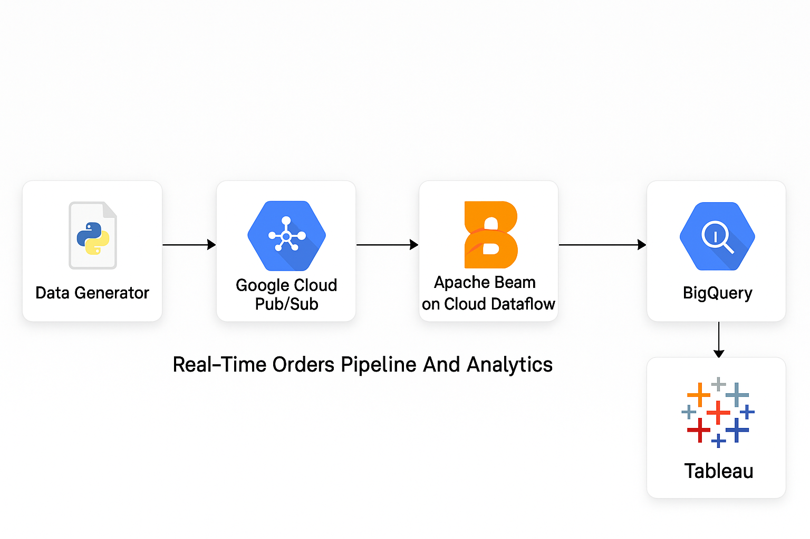
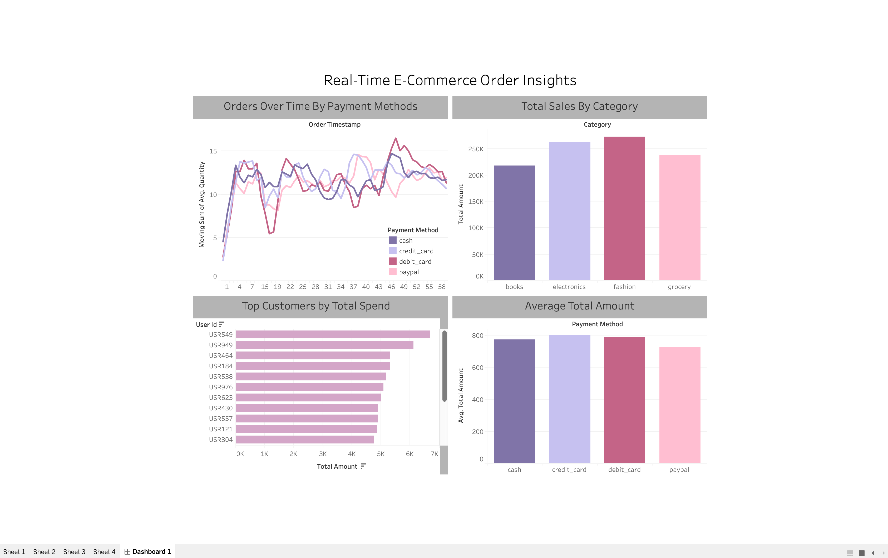

# Real-Time Data Engineering Pipeline for E-Commerce Orders

This project showcases a fully cloud-native, real-time data processing pipeline built on Google Cloud Platform (GCP). It simulates e-commerce order events, processes them using Apache Beam via Dataflow, stores structured data in BigQuery, and visualizes business insights in Tableau.

## Overview
The goal of this project is to demonstrate real-time analytics for an e-commerce scenario using modern data engineering tools and architecture. It involves ingesting simulated order data continuously, transforming it through a scalable streaming pipeline, and enabling real-time business intelligence through live dashboards.

## Architecture
- **Data Generator (Python)**: Simulates continuous stream of e-commerce orders and publishes them to Google Cloud Pub/Sub.
- **Google Cloud Pub/Sub**: Acts as the message ingestion layer.
- **Apache Beam + Google Cloud Dataflow**: Processes the messages in real time using a custom Flex Template pipeline.
- **Google BigQuery**: Stores cleaned and structured order data for downstream querying and analytics.
- **Tableau Desktop**: Connects directly to BigQuery to present KPIs like sales over time, category distribution, and order volume.



## Features
- Real-time ingestion of order data
- Event-driven architecture using Pub/Sub
- Stream processing using Apache Beam
- Scalable deployment with Dataflow Flex Templates
- Structured storage using BigQuery
- Real-time dashboards using Tableau

## Skills Demonstrated
- Cloud-native architecture design
- Streaming data pipelines
- Pub/Sub integration
- Apache Beam pipeline development (Python SDK)
- Flex template creation and deployment
- BigQuery table schema design and querying
- Real-time visualization with Tableau
- Troubleshooting GCP services and Dataflow jobs

## Project Structure
```
├── dataflow_job_script.py       # Apache Beam pipeline
├── api_to_pub_sub.py            # Python data generator and Pub/Sub publisher
├── metadata.json                # Flex Template metadata
├── build.sh                     # Shell script to build and upload the Dataflow template
├── Dockerfile                   # Custom Docker image for Dataflow Flex Template
├── .dockerignore                # Files to exclude from Docker build
├── Architecture.png             # Architecture diagram
├── Tableau-Visualization-Result.png
├── Bigquery.png
├── Pub:Sub.png
├── flex-template-deployment.png
├── Dataflow.png
└── README.md
```

## Setup Instructions

### Prerequisites
- Google Cloud SDK installed and authenticated
- GCP project with billing enabled
- Enabled APIs: Pub/Sub, Dataflow, BigQuery, Cloud Build, Artifact Registry

### 1. Create GCS Bucket
```
gsutil mb -l us-east1 gs://<your-bucket-name>
```

### 2. Configure Pub/Sub
```
gcloud pubsub topics create orders-topic
gcloud pubsub subscriptions create orders-sub --topic=orders-topic
```

### 3. Create BigQuery Dataset and Table
```
gcloud bigquery datasets create order_dataset
gcloud bigquery tables create order_dataset.order_table \
  --schema="order_id:STRING,user_id:STRING,product_id:STRING,category:STRING,price:FLOAT,quantity:INTEGER,total_amount:FLOAT,payment_method:STRING,order_timestamp:TIMESTAMP"
```

### 4. Build and Submit Docker Image
```
gcloud builds submit --tag gcr.io/<PROJECT_ID>/ecommerce-orders-image .
```

### 5. Build Dataflow Flex Template
```
./build.sh
```

### 6. Run the Dataflow Job
```
gcloud dataflow flex-template run "ecommerce-stream-$(date +%Y%m%d-%H%M%S)" \
  --template-file-gcs-location gs://<your-bucket-name>/templates/ecommerce-orders-template.json \
  --region us-east1 \
  --parameters input_subscription=projects/<PROJECT_ID>/subscriptions/orders-sub,output_table=<PROJECT_ID>:order_dataset.order_table
```

### 7. Run Data Generator
```
nohup python3 api_to_pub_sub.py
tail -f publisher.log
```

### 8. Connect Tableau to BigQuery
- Open Tableau Desktop
- Connect to Google BigQuery
- Select your dataset and table
- Build your dashboard
- Set auto-refresh interval for live updates

## Sample Visuals




## Author
Mohan Vamsi Krishna Yanamadala  
Binghamton University  
